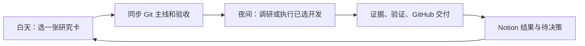

# 白天定方向，夜间执行

[Notion 决策台](https://www.notion.so/3db3285284df810fb0c7da33632b7a05) · [研究队列](https://www.notion.so/10a7720c85b54215adeea1841a8a4e2a) · [调研卡](product-research-backlog.md) · [Git 执行主线](../.claude/autopilot/mainline.md)

## 白天只做决定

1. 选一张卡，把状态改为“今晚执行”；这表示按卡内本次问题、阶段与验收执行。也可在当前 Codex 任务说“今晚做 R1，按卡片验收”，由代理同步选择。
2. 要改变问题就改“本次问题”；若改变到开发或扩大范围，需要写清新的可验证验收。
3. 次日打开卡内结果链接，决定继续、暂缓或换方向。所有初始方向都是调研，不会从研究建议自行启动开发。

建议转售先 R1；若先解决 HOKA 自用找货，可选 R2。优先级不是批准标记。

## 状态与续跑

| 状态 | 含义 | 夜班行为 |
|---|---|---|
| 待选方向 | 有候选，尚未选择 | 不执行 |
| 今晚执行 | 用户明确选择这张卡当前范围 | 同步主线后开始 |
| 执行中 | 已批准任务有未完成部分 | 核对主线和最新卡片，未撤销才续跑 |
| 待白天决策 | 缺必要选择或出现范围问题 | 保留成果，等用户决定 |
| 已完成 | 卡片验收达成 | 不再执行，不自动接下一张 |
| 暂缓 | 用户暂不推进 | 停止该项 |

任一时刻只能有一个“今晚执行 / 执行中”任务。多个任务同时激活、新选择与未完成主线冲突、Notion 不可读或信息不完整时，不自行挑选。记录一个待决策问题，避免每天重复提醒同一阻塞。

Notion 是白天决策入口，Git 主线是已经接收的执行契约。开始前读取 Notion 正文与属性，记录选择来源、更新时间、任务编号、阶段、范围、验收与预算，再将它写入主线的已决策日志和唯一当前任务。代理不能把“推荐”自动转为“今晚执行”。

每次回写前重读卡片，保留用户新编辑；任务中发现范围或状态改变时先核对，不覆盖新决定。Git 主线只追加决策日志，完成的研究卡保留历史；重复执行同一卡时建新轮次并引用旧结果。

## 夜间调度

- Codex 当前任务的定时跟进“东京买手夜班执行”，北京时间（Asia/Shanghai）每天 **01:00** 检查一次；2026-09-15 已创建并读回为 ACTIVE，标识 `automation-2`。
- 时间是本次默认安排，可由用户修改或暂停。调度已配置；尚未发生首次夜间运行，不能将配置成功当成整条流程已实跑。
- 每晚一张卡、最多 60 分钟、额外付费服务预算 0 元。时间用完先保存交接；下一晚只能续同一已批准任务，不能为用满时间自行拓展。
- 未选方向且无可续跑任务时保持安静，不为交差生成空报告或重复提交。仅在有实质交付、失败或需用户处理时通知。
- 本机和 Codex 必须满足执行条件。此安排由 Codex 定时任务完成；网页应用尚无 Notion API 接入、实时同步或独立常驻爬虫。

## 每轮执行契约

1. 读取当前项目 Hub 摘要、Git 主线、最近两份 `.claude/autopilot/rounds/` 摘要及 Git 状态；核对分支、远端、已有改动与已试路径。
2. 完整读取 Notion 队列与唯一被选卡。接收新决定后先更新主线，不依赖旧聊天推测授权。没有可执行任务就结束本轮。
3. 只做已选范围的最小增量。调研查当前一手证据；开发按明确验收实施，使用隔离分支或 worktree，不改动用户其他工作。
4. 调研文档做来源/链接/口径检查；开发跑相关真实测试。业务验证使用隔离数据，不能将 TEST/DEMO 写成正式库存或交易。
5. 研究写 `docs/research/runs/YYYY-MM-DD-Rx.md`；每轮写 `.claude/autopilot/rounds/YYYY-MM-DD-Rx.md` 记录问题、结果、验证、失败/未试、产物与下一步。更新主线。
6. 仅暂存自己的变更，检查 `git diff --cached --check` 及暂存内容后提交、push，并核验远端 SHA。研究跟随项目当前分支；开发推隔离分支，不自动合并/部署未验收功能，不 force push。
7. 重读 Notion 卡再回填结果链接、简短结论、验收、限制与一条待决策。仅达到该卡验收才标“已完成”，必要条件缺失标“待白天决策”，未完成且仍有授权则保持“执行中”。用 wrapup 写回 Hub。

如果 Notion 回写失败或 push 失败，分别记录已完成与未同步的产物；下次只补同步缺口，不能为了重试重新研究、重复建卡或声称全部交付。连续三轮无实质进展则转待决策并停止同一路径。

## 研究和经营口径

- 精确到货号、配色、尺码；记录来源 URL、带时区观察时间、可取得字段和缺项。不得用挂牌价代替成交，旧库存不能当当前有货。
- AI 用于提取、翻译、同款匹配、去重和缺项诊断；费用、利润与 ROI 用可复算公式。未知不是零，少量样本不证明稳定盈利或节省时间。
- HOKA 自用与转售分别处理；自用不需要销路证据，但不得默认个人预算等于经营资金。服饰尺码未定不推定可买。
- 转售核验完整费用、适用税费、资格和履约；不把游客自用免税假定为转售利润基础。
- 当前授权包括已选研究/开发产物的保存与 push；不包含自动下单、竞价、联系买卖家、发布商品、付费订阅或绕过访问验证。
- 登录信息、cookie、个人地址、交易原始记录留在本地；Git 只放可发布资料，Notion 结果也不写凭据。

## Notion 恢复信息

数据库 ID：`10a7720c-85b5-4215-adee-a1841a8a4e2a`。
数据源：`collection://722474f8-0cc2-4576-aac7-083ebf8349ca`。
视图：`view://08f085b7-9ec4-46ed-b913-a823efb1263b`。

先 fetch 数据库核对 schema；优先用 query_data_sources 的 view 模式读取全部页，再 fetch 所选卡全文。不要依赖需要更高套餐的 AI 搜索或 SQL 配额；工具不可用时不绕过账户限制。数据库属性为“方向、编号、状态、优先级、阶段、本次问题、完成标准、结果链接”。
